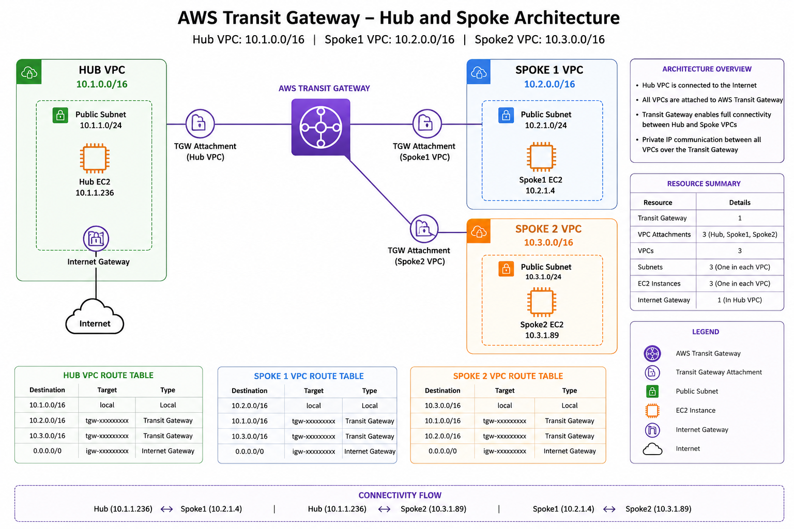
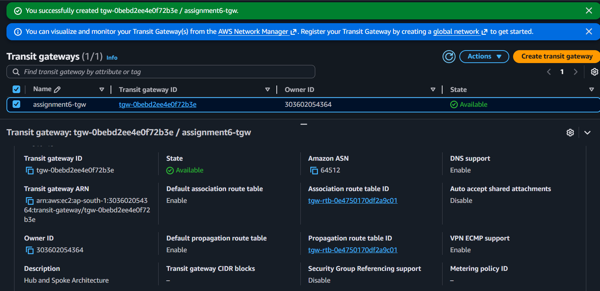
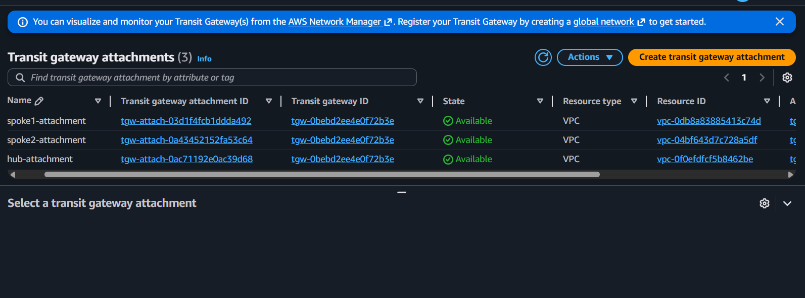
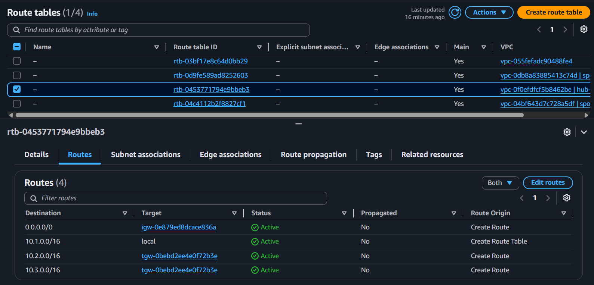
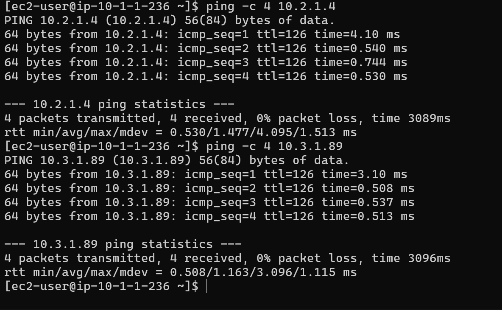

# AWS Assignment 6 - Hub and Spoke Architecture using AWS Transit Gateway

## Project Overview

This project demonstrates the implementation of a **Hub and Spoke network architecture** in Amazon Web Services (AWS) using **AWS Transit Gateway**. The architecture enables secure and centralized communication between multiple Virtual Private Clouds (VPCs), simplifying network management and improving scalability.

This assignment was completed as part of my Cloud Computing coursework.

---

## Objective

- Create one Hub VPC and two Spoke VPCs.
- Deploy an AWS Transit Gateway.
- Attach all VPCs to the Transit Gateway.
- Configure route tables for inter-VPC communication.
- Launch EC2 instances in each VPC.
- Verify connectivity between all VPCs using private IP addresses.

---

## Architecture Diagram

> Replace the image below with your architecture diagram.

<p align="center">
  
</p>

---

## Network Topology

| Component | CIDR Block |
|------------|------------|
| Hub VPC | 10.1.0.0/16 |
| Spoke VPC 1 | 10.2.0.0/16 |
| Spoke VPC 2 | 10.3.0.0/16 |

---

## AWS Services Used

- Amazon VPC
- AWS Transit Gateway
- Amazon EC2
- Internet Gateway
- Route Tables
- Security Groups

---

## Project Structure

```
aws-assignment-6-hub-spoke-architecture/
│
├── README.md
├── Assignment_6_Hub_and_Spoke_Architecture_Report.pdf
│
├── architecture/
│   └── hub-spoke-architecture.png
│
└── screenshots/
    ├── 01-created-hub-vpc.png
    ├── 02-created-spoke-vpc-1.png
    ├── 03-created-spoke-vpc-2.png
    ├── ...
    └── 27-ping-output.png
```

---

## Implementation Steps

### 1. Created Hub VPC

- Hub VPC CIDR: **10.1.0.0/16**

---

### 2. Created Spoke VPCs

- Spoke VPC 1: **10.2.0.0/16**
- Spoke VPC 2: **10.3.0.0/16**

---

### 3. Created Subnets

Each VPC contains one subnet:

| VPC | Subnet |
|------|--------|
| Hub | 10.1.1.0/24 |
| Spoke 1 | 10.2.1.0/24 |
| Spoke 2 | 10.3.1.0/24 |

---

### 4. Configured Internet Gateway

An Internet Gateway was attached to the Hub VPC to provide internet connectivity.

---

### 5. Created AWS Transit Gateway

A Transit Gateway was deployed to act as the central router connecting all VPCs.

---

### 6. Attached VPCs to Transit Gateway

Created three Transit Gateway attachments:

- Hub Attachment
- Spoke 1 Attachment
- Spoke 2 Attachment

---

### 7. Configured Route Tables

Each VPC route table was updated with routes pointing to the Transit Gateway.

---

### 8. Launched EC2 Instances

One EC2 instance was launched in each VPC.

| Instance | Private IP |
|-----------|------------|
| Hub EC2 | 10.1.1.236 |
| Spoke 1 EC2 | 10.2.1.4 |
| Spoke 2 EC2 | 10.3.1.89 |

---

### 9. Verified Connectivity

Connectivity was successfully verified using the **ping** command.

- Hub → Spoke 1 ✅
- Hub → Spoke 2 ✅

This confirms successful inter-VPC communication through AWS Transit Gateway.

---

## Sample Screenshots

### Transit Gateway

<p align="center">

</p>

---

### Transit Gateway Attachments

<p align="center">

</p>

---

### Route Table Configuration

<p align="center">

</p>

---

### Connectivity Test

<p align="center">

</p>

---

## Challenges Faced

- Understanding Transit Gateway routing.
- Configuring inter-VPC route tables correctly.
- Troubleshooting SSH connectivity.
- Verifying communication using private IP addresses.

---

## Learning Outcomes

Through this project, I learned how to:

- Design Hub and Spoke network architecture.
- Configure AWS Transit Gateway.
- Connect multiple VPCs.
- Configure VPC route tables.
- Launch EC2 instances.
- Verify inter-VPC communication.
- Understand centralized cloud networking.

---

## Conclusion

This project successfully demonstrates the implementation of a Hub and Spoke Architecture using AWS Transit Gateway. Multiple VPCs were connected through a centralized Transit Gateway, route tables were configured correctly, and communication between all VPCs was successfully verified. This architecture provides a scalable, secure, and efficient networking solution for cloud environments.
